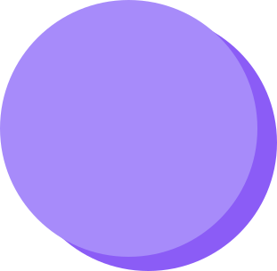
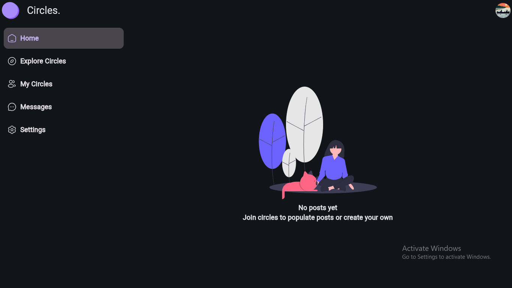

<center><h1>Circles.</h1></center>

## Social media for the minimalist
Circles is a simple, minimalist social media web application built using Python and the Flet framework. It aims to provide a more intentional and curated social networking experience, focusing on meaningful connections and content consumption over endless scrolling.

# Tech stack
## Flet
The entire user interface is built using Flet, a cross-platform and responsive UI framework for Python. Flet's focus on Python best practices ensures a high-quality and customizable user experience.

## Firebase
Circles uses Firebase as its backend, providing a simple and scalable solution for database management and user authentication.

### Miscellaneous
The application uses Google OAuth 2.0 for user authentication. To run the project, you'll need to create a `.env` file and add your client ID and client secret.

### Current progress
- [x] Main UI
- [ ] Firebase Integration
- [ ] Deployment


To run the app:
```
flet run [app_directory] -p 8550
```
## Screenshots


## Installation and Setup
1. Clone the repository: `git clone https://github.com/your-username/circles.git`
2. Navigate to the project directory: `cd circles`
3. Install the required dependencies: `pip install -r requirements.txt`
4. Create a `.env` file in the project directory and add your Google OAuth client ID and client secret:

```
CLIENT_ID=your_client_id
CLIENT_SECRET=your_client_secret
```

5. Run the application: `flet run main.py`

## Roadmap
- [ ] Implement user profiles and social networking features
- [ ] Add support for different types of content (e.g., images, links, polls)
- [ ] Develop a mobile-friendly version of the application
- [ ] Implement advanced privacy and security features

<!-- ## Contributing
Contributions to the Circles project are welcome! If you'd like to report a bug, suggest a feature, or submit a pull request, please follow the guidelines in the [CONTRIBUTING.md](CONTRIBUTING.md) file. -->

## License
Circles is licensed under the [MIT License](LICENSE).

## Author
Circles was created by Navis Ayara ([your-username](https://github.com/Vavis-Ayara)).